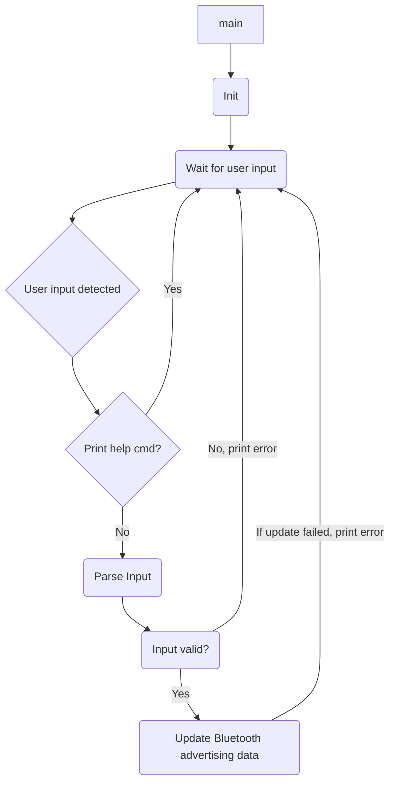
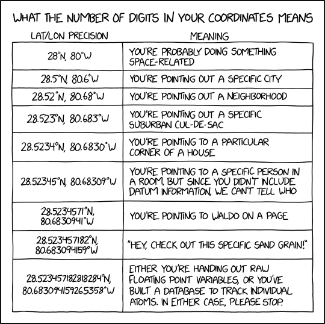

# README:SG: Kou assignment

This tool reads in GPS location data from UART and then updates the
bluetooth advertising data to display those coordinates.

# Formats

The tool expects GPS data in the *Decimal Degrees* format as follows:
> 12.3456789 123.456789

> 12.3456789, 123.456789

> 12.3456789:123.456789

(after a lot of deliberation on the vague requirements that were provided I decided
to restrict input/output to this format, because it's the default format google maps use.)

# Usage and Testing
## Required equipment:
- USB to USB-micro cable
- Laptop with software for reading serial data over USB
	(Windows laptop with [TeraTerm](http://www.teraterm.org/) installed)
	(Linux laptop with [minicom](https://www.poftut.com/install-use-linux-minicom-command-tutorial-examples/) installed)
- nrf52840 DK programmed with the tool
- Smartphone with bluetooth capability and nRF Connect for mobile application installed

## Usage
- connect the device to PC using the USB cable
- Switch on the device
- Switch on TeraTerm / minicom
- Configure Serial port (COM6 / ttyASM0)to 115200 baud / 1 stop bit / no parity
- On TeraTerm in Setup->Terminal set **Recieve to LF**, **Transmit to LF** and **tick "Local Echo"**
- In minicom press ctrl+a z e to switch on local echo
- Type in help for help
- Type in GPS location data in supported format(see Format)
- Observe "GPS location data updated" message
- Open the nRF Connect for mobile app
- Observe "SG: Kou assignment" beacon in the scanner tab
- Expand the "SG: Kou assignment" device
- Click on Manufacturer data
- Select data format as "Text(UTF-8)" as seen below

- Observe GPS location data displayed in Decimal Degrees format

			
			

## Logic

UART peripheral sample was chosen as a base template for the project. System was built using the nRF Connect toolchain. Program flow is as follows:

Data is parsing is handled in parser.h/parser.c

Up to 40 characters of input data are processed at a time.

Output data is sent as a string within the Manufacturer Specific Data section of the Bluetooth advertising packet.

Output data is printed with 5 decimal points, because

